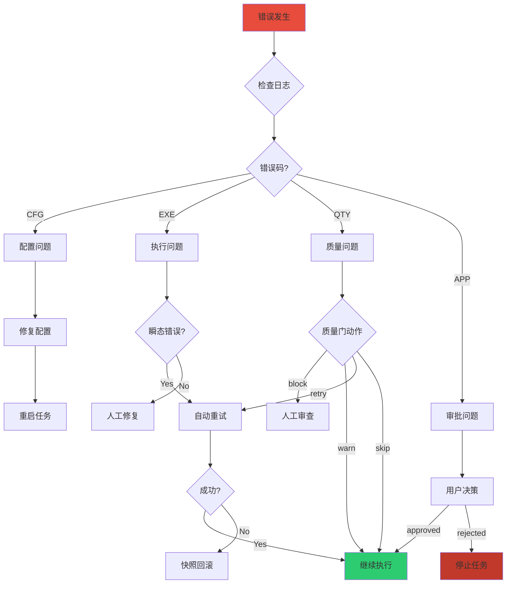

# AII上下文助手 - 故障排查手册

## 目录

1. [常见问题 FAQ](#常见问题-faq)
2. [错误码参考](#错误码参考)
3. [故障排查流程](#故障排查流程)
4. [性能调优指南](#性能调优指南)
5. [日志分析](#日志分析)

---

## 常见问题 FAQ

### Q1: 任务卡在 `input_collecting` 阶段不动？

**症状**:
```
[Orchestrator] 暂停于 input_collecting，等待用户输入
```

**原因**: 系统正常行为，等待用户提交需求。

**解决方案**:
```python
# 调用 handle_user_input 提交需求
orch.handle_user_input("帮我写一个排序算法")
result = orch.run()
```

---

### Q2: 报错 `anthropic 库未安装，降级到 FallbackCaller`？

**症状**:
```
[AgentCaller] anthropic 库未安装，降级到 FallbackCaller (subprocess)
```

**原因**: 未安装 Anthropic SDK，系统自动降级到 CLI 模式。

**解决方案**:
```bash
# 方案1: 安装 SDK (推荐)
pip install anthropic

# 方案2: 使用 Fallback 模式
# 确保 claude CLI 已安装并配置
claude --version
```

---

### Q3: 验证失败后任务停止，如何重试？

**症状**:
```
[Orchestrator] verifying → executing (重试)
retry_count: 3/3
任务失败
```

**原因**: 重试次数已达上限 (默认3次)。

**解决方案**:
```python
# 方案1: 从快照回滚
db = StateDB("workflows/TASK-001")
db.rollback_to_snapshot(task_id, snapshot_id)

# 方案2: 重新初始化任务
db.init_task("TASK-001")
orch.handle_user_input("新的需求")
```

---

### Q4: Token 用量超限警告？

**症状**:
```
[Orchestrator] WARNING Token 警告: 总用量 60000 超过 50000
```

**原因**: Token 累计用量超过阈值 (默认50000)。

**解决方案**:
```python
# 方案1: 调整阈值
from core.orchestrator import TOKEN_WARNING_THRESHOLD
TOKEN_WARNING_THRESHOLD = 100000

# 方案2: 检查 Token 用量
state = db.get_state(task_id)
print(f"Input tokens: {state['total_input_tokens']}")
print(f"Output tokens: {state['total_output_tokens']}")
```

---

### Q5: SQLite 数据库锁定错误？

**症状**:
```
sqlite3.OperationalError: database is locked
```

**原因**: 多进程并发访问 SQLite，WAL 模式未生效。

**解决方案**:
```python
# 检查 WAL 模式
db = StateDB("workflows/TASK-001")
cursor = db.conn.execute("PRAGMA journal_mode;")
print(cursor.fetchone())  # 应该是 ('wal',)

# 如果不是 WAL，手动启用
db.conn.execute("PRAGMA journal_mode=WAL;")
```

---

### Q6: 质量门检查失败？

**症状**:
```
[QualityGate] Block: 代码质量不达标
```

**原因**: 代码未通过质量门检查。

**解决方案**:
```bash
# 查看质量门配置
cat config/quality_gates.yaml

# 手动运行质量门
python -c "
from core.quality_gates import QualityGateRunner
runner = QualityGateRunner()
result = runner.run('executing', {'code_path': 'artifacts/code'})
print(result)
"
```

---

### Q7: Agent 调用超时？

**症状**:
```
TimeoutError: Agent call timed out after 300 seconds
```

**原因**: Agent 执行时间过长。

**解决方案**:
```python
# 方案1: 增加超时时间
from core.agent_caller import FallbackCaller
caller = FallbackCaller(timeout=600)  # 10分钟

# 方案2: 优化 Agent 性能
# 检查 Agent 定义文件 .claude/agents/*.md
```

---

### Q8: 找不到 Agent 定义文件？

**症状**:
```
FileNotFoundError: Agent definition not found: .claude/agents/coder.md
```

**原因**: Agent 定义文件缺失或路径错误。

**解决方案**:
```bash
# 检查 Agent 定义文件
ls -la .claude/agents/

# 如果缺失，从模板创建
cat > .claude/agents/coder.md << 'EOF'
# Coder Agent

## Purpose
Generate code based on requirements.

## Input
- requirements.md
- optimal_prompt.md

## Output
- artifacts/code/*.py
EOF
```

---

## 错误码参考

### CFG - 配置错误 (立即停止)

| 错误码 | 说明 | 解决方案 |
|--------|------|----------|
| CFG-001 | 配置文件缺失 | 检查 config/ 目录 |
| CFG-002 | 配置格式错误 | 验证 JSON/YAML 格式 |
| CFG-003 | Agent 定义缺失 | 检查 .claude/agents/*.md |
| CFG-004 | 白名单配置错误 | 检查 skill_whitelist.json |
| CFG-005 | 质量门配置错误 | 检查 quality_gates.yaml |
| CFG-006 | 变量注入失败 | 检查 ${var} 占位符 |

### EXE - 执行错误 (可重试)

| 错误码 | 说明 | 重试策略 |
|--------|------|----------|
| EXE-101 | 网络超时 | Poisson 抖动重试 |
| EXE-102 | API 限流 | 指数退避重试 |
| EXE-103 | 认证失败 | **不可重试** |
| EXE-104 | 资源不足 | 等待后重试 |
| EXE-105 | 权限错误 | **不可重试** |
| EXE-106 | 临时故障 | 立即重试 |
| EXE-107 | 数据格式错误 | **不可重试** |
| EXE-108 | 业务逻辑错误 | **不可重试** |

### QTY - 质量错误

| 错误码 | 说明 | 动作 |
|--------|------|------|
| QTY-201 | 测试失败 | retry |
| QTY-202 | 覆盖率不足 | **block** |
| QTY-203 | 性能不达标 | **block** |
| QTY-204 | 代码规范违规 | warn |

### APP - 审批错误

| 错误码 | 说明 | 处理 |
|--------|------|------|
| APP-301 | 审批超时 | 提醒用户 |
| APP-302 | 审批拒绝 | **停止任务** |
| APP-303 | 审批取消 | **停止任务** |
| APP-304 | 审批错误 | **停止任务** |

---

## 故障排查流程

### 流程图



### 排查步骤

#### 1. 检查日志

```bash
# 查看最新日志
tail -100 workflows/TASK-001/state.db

# 搜索错误
grep "ERROR" workflows/TASK-001/artifacts/*.log

# 查看快照
ls -la workflows/TASK-001/snapshots/
```

#### 2. 验证状态

```python
from core import StateDB

db = StateDB("workflows/TASK-001")
state = db.get_state("TASK-001")

print(f"Status: {state['status']}")
print(f"Step index: {state['step_index']}")
print(f"Retry count: {state['retry_count']}")
print(f"User input: {state['user_input_json']}")
```

#### 3. 检查配置

```bash
# 验证配置文件
python -c "
import json
from pathlib import Path

# 检查 skill_whitelist.json
whitelist = json.loads(Path('config/skill_whitelist.json').read_text())
print('Whitelist loaded:', len(whitelist.get('skills', [])))

# 检查 quality_gates.yaml
import yaml
gates = yaml.safe_load(Path('config/quality_gates.yaml').read_text())
print('Quality gates loaded:', len(gates.get('gates', [])))
"
```

#### 4. 测试 Agent 调用

```python
from core import AgentCaller

caller = AgentCaller.create(".")
result = caller.call("input_collector", "workflows/TEST-001", {})
print(result)
```

---

## 性能调优指南

### 1. Token 优化

**目标**: 减少 Token 消耗，降低成本。

**策略**:
- 使用缓存: 启用 `cache_creation_input_tokens`
- 精简提示词: 移除冗余描述
- 分段处理: 大任务拆分为小任务

**监控**:
```python
state = db.get_state(task_id)
efficiency = state['total_output_tokens'] / state['total_input_tokens']
print(f"Token 效率: {efficiency:.2f}")
```

### 2. 并发优化

**目标**: 提高吞吐量。

**策略**:
- 启用 WAL 模式: `PRAGMA journal_mode=WAL`
- 批量处理: 多任务并行执行
- 异步调用: 使用 `asyncio`

**示例**:
```python
import asyncio
from core import Orchestrator

async def run_tasks(task_ids):
    tasks = [
        Orchestrator(f"workflows/{tid}", tid).run()
        for tid in task_ids
    ]
    return await asyncio.gather(*tasks)

# 运行多个任务
results = asyncio.run(run_tasks(["TASK-001", "TASK-002", "TASK-003"]))
```

### 3. 数据库优化

**目标**: 减少 I/O 延迟。

**策略**:
- 定期清理: 删除旧快照
- 索引优化: 为常用查询建索引
- 连接池: 复用数据库连接

**清理脚本**:
```python
from pathlib import Path
from datetime import datetime, timedelta

# 清理7天前的快照
cutoff = datetime.now() - timedelta(days=7)
snapshots_dir = Path("workflows/TASK-001/snapshots")

for snapshot in snapshots_dir.glob("*.json"):
    mtime = datetime.fromtimestamp(snapshot.stat().st_mtime)
    if mtime < cutoff:
        snapshot.unlink()
        print(f"Deleted: {snapshot.name}")
```

---

## 日志分析

### 日志格式

```
[时间戳] [模块名] 消息内容
```

### 关键日志模式

#### 成功流程
```
[StateDB] 任务初始化: TASK-001
[Orchestrator] input_collecting → requirement_optimizing
[StateDB] 状态更新: TASK-001 → archiving
[Orchestrator] archiving → archiving (最终阶段)
```

#### 失败流程
```
[StateDB] 状态更新: TASK-001 → verifying
[Orchestrator] verifying → executing (重试)
[StateDB] increment_retry: TASK-001 → retry_count=3
[Orchestrator] ERROR [TASK-001] [TEST_FAIL] 验证失败
```

### 日志分析工具

```bash
# 统计错误类型
grep "ERROR" workflows/*/artifacts/*.log | cut -d'[' -f4 | sort | uniq -c

# 查找慢请求
grep "Token 累加" workflows/*/state.db | awk '{print $NF}' | sort -n

# 提取失败任务
grep "任务失败" workflows/*/artifacts/*.log
```

---

## 联系支持

如果以上方法无法解决问题，请：

1. 收集诊断信息:
```bash
# 导出诊断包
python -c "
from core import StateDB
import json
from pathlib import Path

task_id = 'TASK-001'
db = StateDB(f'workflows/{task_id}')

diag = {
    'state': db.get_state(task_id),
    'snapshots': len(list(Path(f'workflows/{task_id}/snapshots').glob('*.json'))),
    'artifacts': len(list(Path(f'workflows/{task_id}/artifacts').glob('*'))),
}

Path('diagnostic.json').write_text(json.dumps(diag, indent=2))
print('Diagnostic exported to diagnostic.json')
"
```

2. 提交 Issue:
   - 附上 `diagnostic.json`
   - 描述复现步骤
   - 说明预期行为 vs 实际行为

---

**更新日期**: 2026-04-23
**版本**: v0.5.0