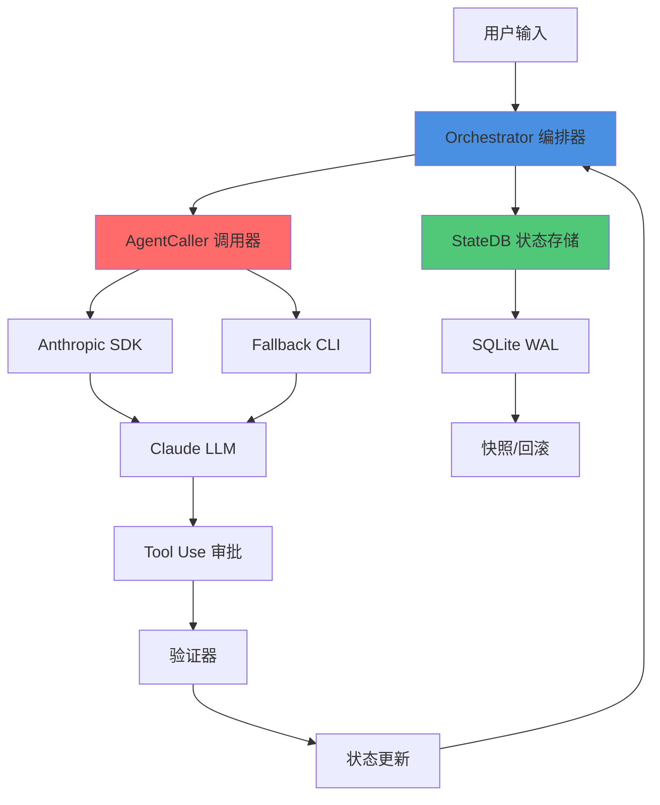
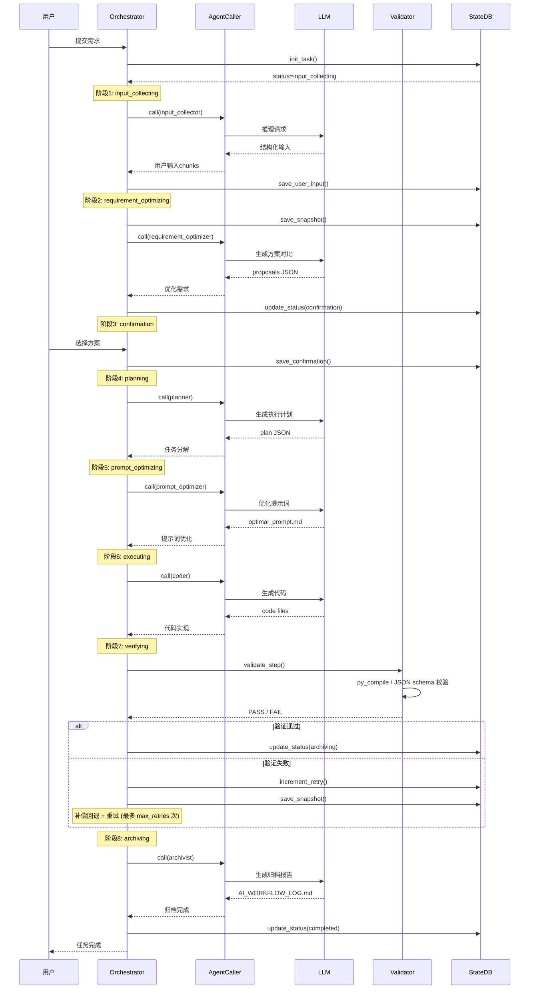
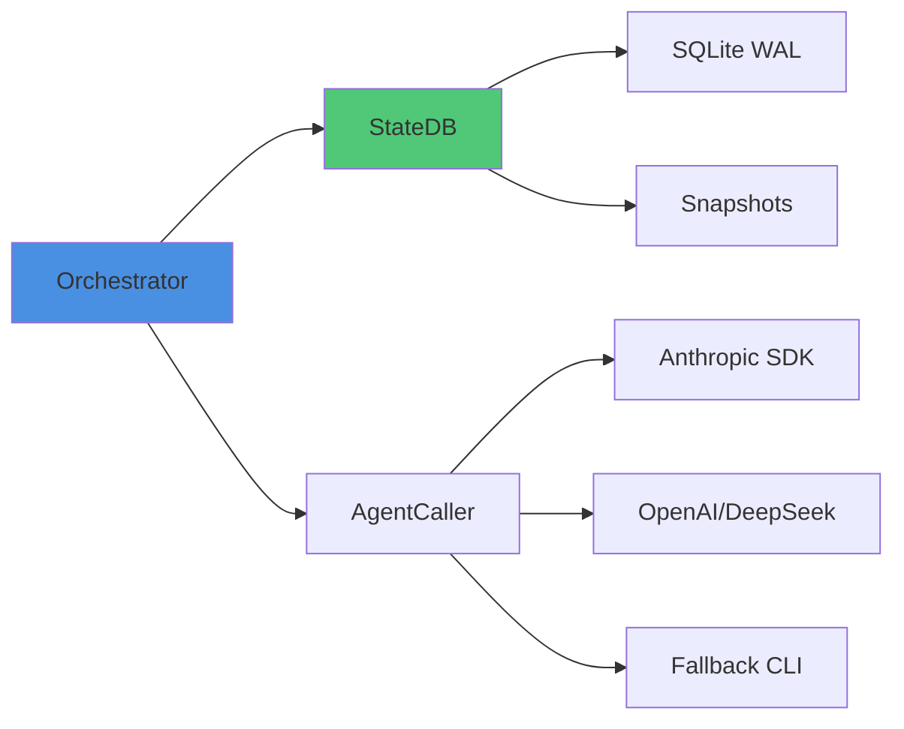
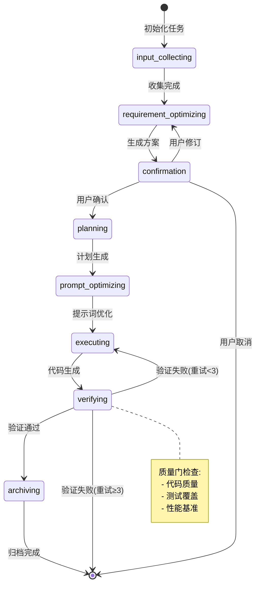
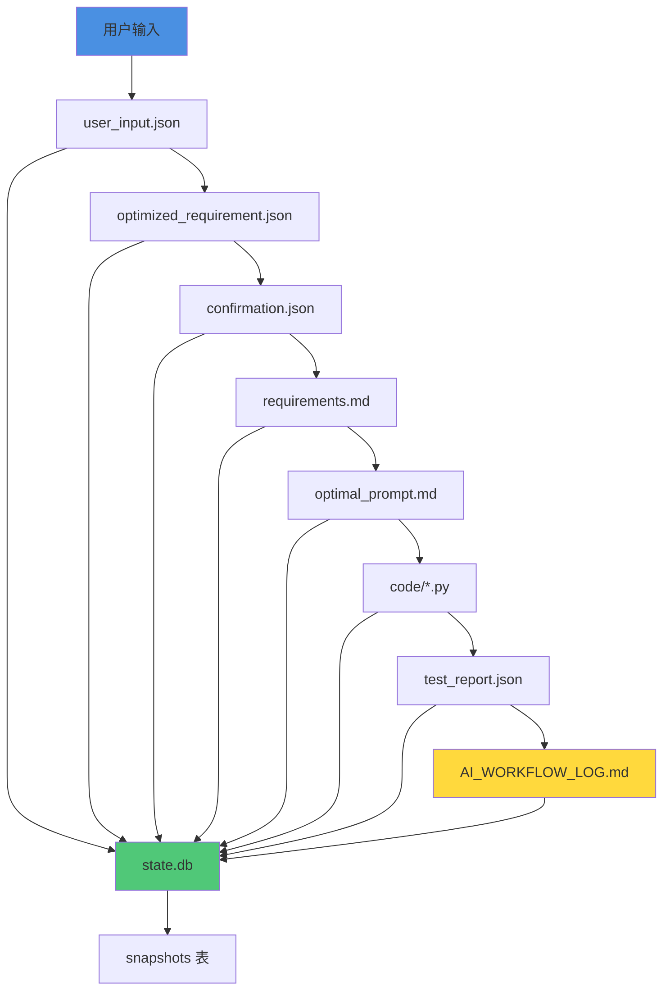
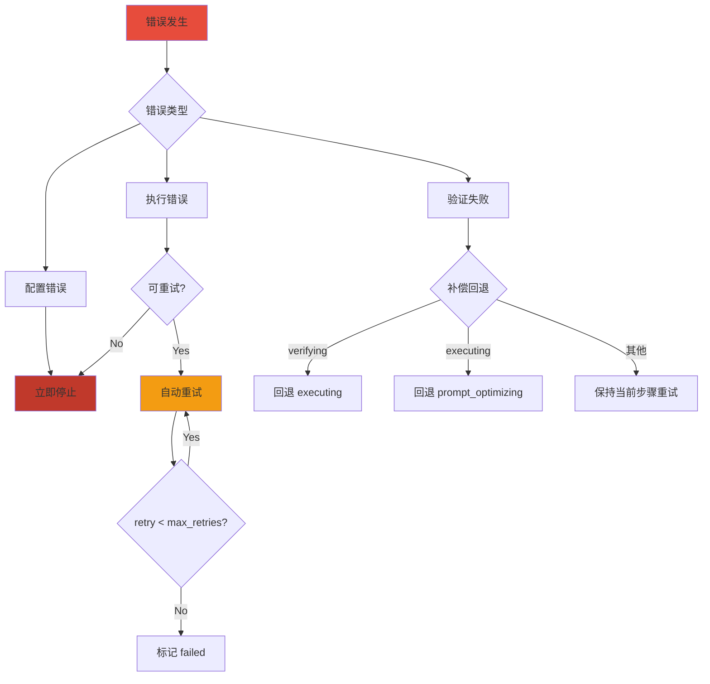

# AII上下文助手 - 系统架构图

## 整体架构流程图

## 8阶段流水线执行流程

## 核心模块依赖关系

## 状态流转图

## 数据流图

## 错误处理流程

---

## 架构说明

### 核心设计原则

1. **分层职责分离**: Orchestrator (编排) → AgentCaller (调用) → LLM (推理)
2. **确定性执行**: 状态驱动，快照回滚
3. **Fail-Fast 拦截**: 验证器语法检查 + 重试耗尽检测
4. **补偿回退**: verifying → executing → prompt_optimizing 逐级回退

### 关键组件

- **Orchestrator**: Python 编排器，驱动流水线流转，retry/compensation 管理
- **StateDB**: SQLite WAL 状态存储，支持快照/回滚
- **AgentCaller**: OpenAI/Anthropic/Fallback 多模式调用器
- **Validator**: 步骤输出验证（JSON schema / py_compile / 文件存在检查）

### 数据持久化

- **state.db**: 任务状态 (SQLite WAL)
- **artifacts/**: 阶段产物 (JSON/MD/PY)
- **snapshots/**: 快照备份（snapshots 表，内置于 state.db）

---

**生成工具**: Mermaid CLI
**更新日期**: 2026-04-23